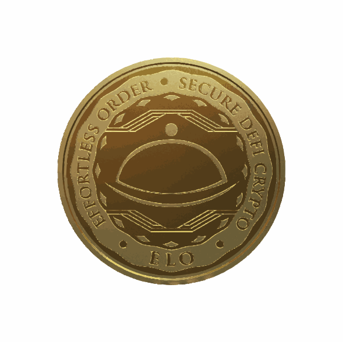
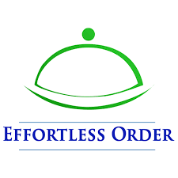
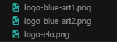

# ERC20 Token DApp - Web3 Frontend

[](https://ethereum.org/en/web3/)
[](https://react.dev/)
[](https://developer.mozilla.org/en-US/docs/Web/JavaScript)
[](https://vitejs.dev/)
[](https://docs.ethers.org/)

> Professional Web3 dApp interface focused on ERC-20 token operations, wallet connection, and DeFi flows.

<p align="center">
  
  
</p>

<p align="center">
  
</p>

---

## Language / Idioma

- [English](#english)
- [Portugues](#portugues)

---

## English

### Overview
This project is a **Web3 dApp frontend** that enables users to connect their wallet and interact with blockchain-powered token features, including:

- ERC-20 token balance and wallet interactions
- Pre-sale participation
- Token swap flows
- Staking features
- Mint flow integration
- NFT and transaction views

### Why this project stands out
- Strong Web3 product direction with practical DeFi use cases
- Modern frontend architecture with reusable component-driven UI
- Wallet onboarding for real blockchain interaction
- Recruiter-friendly showcase of React + Web3 engineering skills

### Tech stack
- **Core:** React 17, Vite, React Router
- **UI:** MUI, Ant Design
- **Web3 / Blockchain:** ethers, web3-react, WalletConnect, react-moralis
- **Tooling:** npm, ESLint, Prettier

### Local setup
> Recommended Node version: **18.19.0**

```bash
npm install
npm run start
```

If your environment uses Vite scripts:

```bash
npm run dev
```

### Project structure
- `src/containers`: page-level flows (pre-sale, swap, stake, mint, NFTs, transactions)
- `src/components`: reusable UI and wallet/web3 interaction components
- `src/providers`: app providers (including Moralis/Web3 context)
- `contracts` and `Truffle`: smart contract and blockchain tooling support

---

## Portugues

### Visao geral
Este projeto e um **frontend de dApp Web3** que permite conectar carteira e interagir com funcionalidades de token na blockchain, incluindo:

- Consulta e interacao com saldo de token ERC-20
- Participacao em pre-sale
- Fluxos de swap
- Funcionalidades de staking
- Integracao de mint
- Visualizacao de NFTs e transacoes

### Diferenciais para portfolio e recrutadores
- Direcionamento claro para produto Web3 com casos DeFi reais
- Arquitetura frontend moderna e componentizada
- Integracao com carteiras para uso on-chain real
- Excelente vitrine de habilidades em React + Web3

### Tecnologias utilizadas
- **Core:** React 17, Vite, React Router
- **UI:** MUI, Ant Design
- **Web3 / Blockchain:** ethers, web3-react, WalletConnect, react-moralis
- **Ferramentas:** npm, ESLint, Prettier

### Como rodar localmente
> Versao recomendada do Node: **18.19.0**

```bash
npm install
npm run start
```

Se o ambiente estiver com scripts Vite:

```bash
npm run dev
```

### Estrutura do projeto
- `src/containers`: fluxos principais (pre-sale, swap, stake, mint, NFTs, transacoes)
- `src/components`: componentes reutilizaveis de UI e integracao Web3
- `src/providers`: providers da aplicacao (incluindo contexto Moralis/Web3)
- `contracts` e `Truffle`: suporte a contratos e stack blockchain
